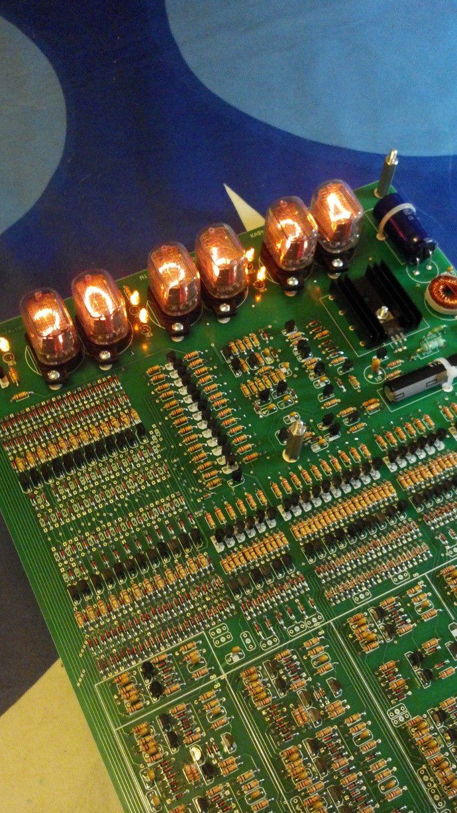

In 2013 I built a clock from a kit purchased here:  https://tube-clock.com/

* [Manual](neon_man.pdf)

* set_board - start of a design to set the time using an ESP32
* case - acrylic case design

Some circuit analysis for setting remotely.

Set switches (ref schematic in manual):

SW1 (minutes) - page 8/23 (PDF page 70)
SW2 (Hours) - page 10/23 (PDF page 72)
SW3 (s hold) - page 2/23 (PDF page 64)

### 2026-04-23

Reviving the "set board" project.  Thinking of a new design with an
ESP-01 serial WiFi module connected to a small AVR (ATTiny85?).
This could be much lower power or even fire up once only on power-up
to retrieve the time from somewhere.

The main issue may be poor wifi in the kitchen!

